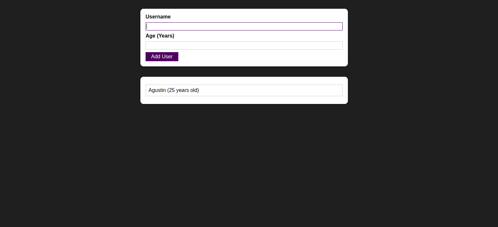

# User list - Demo - React
This small website will get a username and age, verify the input is valid and add it to a list shown at the bottom of the page.

The main learning goals for this project were:
- Learn how modals work
- Learn how to manage different states
- Keep improving my React skills

## Screenshots 📷

## Built with 🛠️
- JavaScript
- HTML
- CSS
- React

## Authors ✒️
- Agustin Aon - [@aon](https://github.com/aon)
